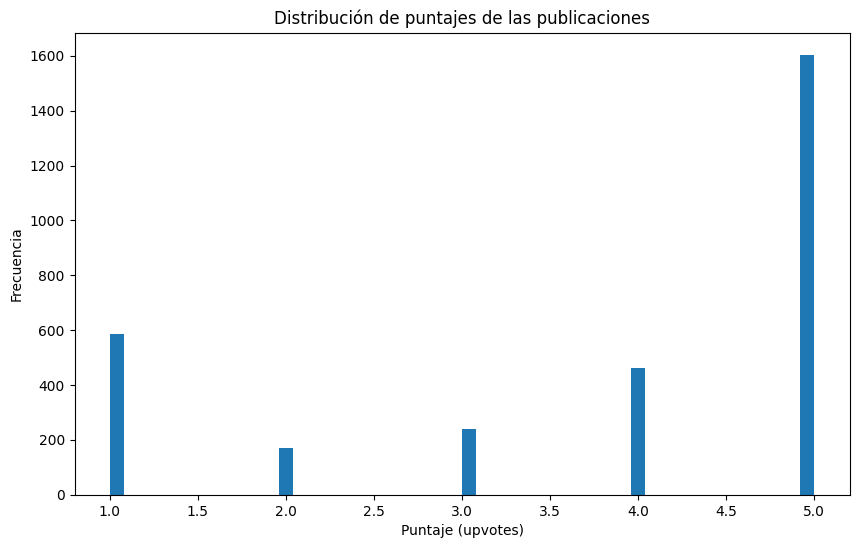
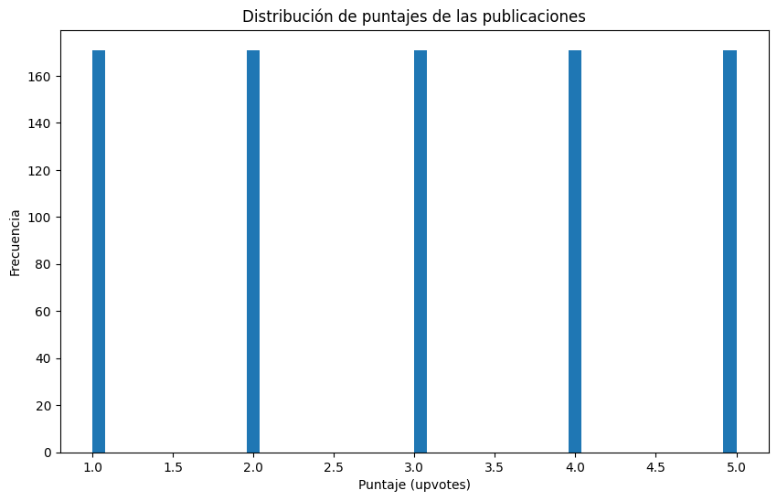

Primero se debe instalar todas las librerías necesarias para leer y
analizar los datos.

<!-- WARNING: THIS FILE WAS AUTOGENERATED! DO NOT EDIT! -->

``` python
# !pip install numpy
# !pip install pandas
# !pip install scikit-learn
# !pip install seaborn
# !pip install spacy
# !pip install nltk
# !pip install matplotlib
# ! python -m spacy download es_core_news_sm
```

Luego, importar las librerias instaladas.

``` python
import pandas as pd    
import spacy
import nltk 
import matplotlib.pyplot as plt


from sklearn.feature_extraction.text import CountVectorizer  
from sklearn.pipeline import Pipeline, FeatureUnion
from sklearn.naive_bayes import MultinomialNB
from sklearn.linear_model import LogisticRegression
from sklearn.model_selection import train_test_split
from sklearn.metrics import confusion_matrix, f1_score, classification_report
from sklearn.feature_extraction.text import TfidfVectorizer

from nltk.stem import SnowballStemmer
from nltk.corpus import stopwords

from spacy.lang.es.stop_words import STOP_WORDS
nlp = spacy.load("es_core_news_sm", disable=['ner', 'parser', 'tagger'])
```

Cargar los datos y realizar un respaldo en caso de pérdida.

``` python
dataset = pd.read_csv('datos.csv')
dataset_r = dataset.copy(deep=True) # respaldo

print('Cargando datos...')

dataset
```

    Cargando datos...

<div>
<style scoped>
    .dataframe tbody tr th:only-of-type {
        vertical-align: middle;
    }
&#10;    .dataframe tbody tr th {
        vertical-align: top;
    }
&#10;    .dataframe thead th {
        text-align: right;
    }
</style>

<table class="dataframe" data-quarto-postprocess="true" data-border="1">
<thead>
<tr class="header" style="text-align: right;">
<th data-quarto-table-cell-role="th"></th>
<th data-quarto-table-cell-role="th">productAsin</th>
<th data-quarto-table-cell-role="th">country</th>
<th data-quarto-table-cell-role="th">date</th>
<th data-quarto-table-cell-role="th">isVerified</th>
<th data-quarto-table-cell-role="th">ratingScore</th>
<th data-quarto-table-cell-role="th">reviewTitle</th>
<th data-quarto-table-cell-role="th">reviewDescription</th>
<th data-quarto-table-cell-role="th">reviewUrl</th>
<th data-quarto-table-cell-role="th">reviewedIn</th>
<th data-quarto-table-cell-role="th">variant</th>
<th data-quarto-table-cell-role="th">variantAsin</th>
</tr>
</thead>
<tbody>
<tr class="odd">
<td data-quarto-table-cell-role="th">0</td>
<td>B09G9BL5CP</td>
<td>India</td>
<td>11-08-2024</td>
<td>True</td>
<td>4</td>
<td>No charger</td>
<td>Every thing is good about iPhones, there's not...</td>
<td>https://www.amazon.in/gp/customer-reviews/R345...</td>
<td>Reviewed in India on 11 August 2024</td>
<td>Colour: MidnightSize: 256 GB</td>
<td>B09G9BQS98</td>
</tr>
<tr class="even">
<td data-quarto-table-cell-role="th">1</td>
<td>B09G9BL5CP</td>
<td>India</td>
<td>16-08-2024</td>
<td>True</td>
<td>5</td>
<td>iPhone 13 256GB</td>
<td>It look so fabulous, I am android user switche...</td>
<td>https://www.amazon.in/gp/customer-reviews/R2HJ...</td>
<td>Reviewed in India on 16 August 2024</td>
<td>Colour: MidnightSize: 256 GB</td>
<td>B09G9BQS98</td>
</tr>
<tr class="odd">
<td data-quarto-table-cell-role="th">2</td>
<td>B09G9BL5CP</td>
<td>India</td>
<td>14-05-2024</td>
<td>True</td>
<td>4</td>
<td>Flip camera option nill</td>
<td>I tried to flip camera while recording but no ...</td>
<td>https://www.amazon.in/gp/customer-reviews/R3Y7...</td>
<td>Reviewed in India on 14 May 2024</td>
<td>Colour: MidnightSize: 256 GB</td>
<td>B09G9BQS98</td>
</tr>
<tr class="even">
<td data-quarto-table-cell-role="th">3</td>
<td>B09G9BL5CP</td>
<td>India</td>
<td>24-06-2024</td>
<td>True</td>
<td>5</td>
<td>Product</td>
<td>100% genuine</td>
<td>https://www.amazon.in/gp/customer-reviews/R1P9...</td>
<td>Reviewed in India on 24 June 2024</td>
<td>Colour: MidnightSize: 256 GB</td>
<td>B09G9BQS98</td>
</tr>
<tr class="odd">
<td data-quarto-table-cell-role="th">4</td>
<td>B09G9BL5CP</td>
<td>India</td>
<td>18-05-2024</td>
<td>True</td>
<td>5</td>
<td>Good product</td>
<td>Happy to get the iPhone 13 in Amazon offer</td>
<td>https://www.amazon.in/gp/customer-reviews/R1XI...</td>
<td>Reviewed in India on 18 May 2024</td>
<td>Colour: MidnightSize: 256 GB</td>
<td>B09G9BQS98</td>
</tr>
<tr class="even">
<td data-quarto-table-cell-role="th">...</td>
<td>...</td>
<td>...</td>
<td>...</td>
<td>...</td>
<td>...</td>
<td>...</td>
<td>...</td>
<td>...</td>
<td>...</td>
<td>...</td>
<td>...</td>
</tr>
<tr class="odd">
<td data-quarto-table-cell-role="th">3057</td>
<td>B09G9D8KRQ</td>
<td>India</td>
<td>11-10-2023</td>
<td>True</td>
<td>1</td>
<td>Very bad experience with i phone 13</td>
<td>Useless phon never buy this heat n useless cam...</td>
<td>https://www.amazon.in/gp/customer-reviews/R10O...</td>
<td>Reviewed in India on 11 October 2023</td>
<td>Colour: (PRODUCT) REDSize: 128 GB</td>
<td>B09G99CW2N</td>
</tr>
<tr class="even">
<td data-quarto-table-cell-role="th">3058</td>
<td>B09G9D8KRQ</td>
<td>India</td>
<td>14-10-2022</td>
<td>True</td>
<td>2</td>
<td>not happy with this apple product</td>
<td>iam not happy with this product why because ch...</td>
<td>https://www.amazon.in/gp/customer-reviews/R2FW...</td>
<td>Reviewed in India on 14 October 2022</td>
<td>Colour: (PRODUCT) REDSize: 128 GB</td>
<td>B09G99CW2N</td>
</tr>
<tr class="odd">
<td data-quarto-table-cell-role="th">3059</td>
<td>B09G9D8KRQ</td>
<td>India</td>
<td>24-02-2022</td>
<td>True</td>
<td>3</td>
<td>Good phone</td>
<td>Good phone</td>
<td>https://www.amazon.in/gp/customer-reviews/R2C7...</td>
<td>Reviewed in India on 24 February 2022</td>
<td>Colour: (PRODUCT) REDSize: 128 GB</td>
<td>B09G99CW2N</td>
</tr>
<tr class="even">
<td data-quarto-table-cell-role="th">3060</td>
<td>B09G9D8KRQ</td>
<td>India</td>
<td>16-10-2023</td>
<td>True</td>
<td>1</td>
<td>Battery discharge</td>
<td>While charging mobile it's getting so hot even...</td>
<td>https://www.amazon.in/gp/customer-reviews/R3K0...</td>
<td>Reviewed in India on 16 October 2023</td>
<td>Colour: (PRODUCT) REDSize: 128 GB</td>
<td>B09G99CW2N</td>
</tr>
<tr class="odd">
<td data-quarto-table-cell-role="th">3061</td>
<td>B09G9D8KRQ</td>
<td>India</td>
<td>11-11-2023</td>
<td>True</td>
<td>1</td>
<td>Batter power needs to be improved</td>
<td>Battery power is be very bad need to chat on d...</td>
<td>https://www.amazon.in/gp/customer-reviews/R2QO...</td>
<td>Reviewed in India on 11 November 2023</td>
<td>Colour: (PRODUCT) REDSize: 128 GB</td>
<td>B09G99CW2N</td>
</tr>
</tbody>
</table>

<p>3062 rows × 11 columns</p>
</div>

Graficar la distribución de puntajes.

``` python
plt.figure(figsize=(10,6))
dataset['ratingScore'].plot(kind='hist', bins=50)
plt.title('Distribución de puntajes de las publicaciones')
plt.xlabel('Puntaje (upvotes)')
plt.ylabel('Frecuencia')
plt.show()
```



Se puede ver que existen una gran cantidad de respuestas positivas sobre
el equipo. Sin embargo, también se puede apreciar una cantidad no menor
de respuestas negativas al equipo.

``` python
tamanos_subcategorias = dataset.groupby('ratingScore').size()

# Crear un DataFrame con las subcategorías y sus tamaños
dataset_subset = pd.DataFrame({
    'Subcategoría': tamanos_subcategorias.index,
    'Tamaño': tamanos_subcategorias.values
})

# Mostrar el DataFrame
dataset_subset
```

<div>
<style scoped>
    .dataframe tbody tr th:only-of-type {
        vertical-align: middle;
    }
&#10;    .dataframe tbody tr th {
        vertical-align: top;
    }
&#10;    .dataframe thead th {
        text-align: right;
    }
</style>

<table class="dataframe" data-quarto-postprocess="true" data-border="1">
<thead>
<tr class="header" style="text-align: right;">
<th data-quarto-table-cell-role="th"></th>
<th data-quarto-table-cell-role="th">Subcategoría</th>
<th data-quarto-table-cell-role="th">Tamaño</th>
</tr>
</thead>
<tbody>
<tr class="odd">
<td data-quarto-table-cell-role="th">0</td>
<td>1</td>
<td>587</td>
</tr>
<tr class="even">
<td data-quarto-table-cell-role="th">1</td>
<td>2</td>
<td>171</td>
</tr>
<tr class="odd">
<td data-quarto-table-cell-role="th">2</td>
<td>3</td>
<td>239</td>
</tr>
<tr class="even">
<td data-quarto-table-cell-role="th">3</td>
<td>4</td>
<td>461</td>
</tr>
<tr class="odd">
<td data-quarto-table-cell-role="th">4</td>
<td>5</td>
<td>1604</td>
</tr>
</tbody>
</table>

</div>

``` python
min_samples = dataset_subset['Tamaño'].min()

print(f"El número mínimo de ejemplos entre las subcategorías es: {min_samples}")

g = dataset.groupby('ratingScore')

dataset_balanceado = g.apply(lambda x: x.sample(min_samples)).reset_index(drop=True)


print(f"Tamaño del dataset balanceado: {len(dataset_balanceado)}")
print("Tamaño por subcategoría después del balanceo:")
print(dataset_balanceado.groupby('ratingScore').size())

dataset_balanceado
```

    El número mínimo de ejemplos entre las subcategorías es: 171
    Tamaño del dataset balanceado: 855
    Tamaño por subcategoría después del balanceo:
    ratingScore
    1    171
    2    171
    3    171
    4    171
    5    171
    dtype: int64

    /tmp/ipykernel_72519/1001277432.py:7: DeprecationWarning: DataFrameGroupBy.apply operated on the grouping columns. This behavior is deprecated, and in a future version of pandas the grouping columns will be excluded from the operation. Either pass `include_groups=False` to exclude the groupings or explicitly select the grouping columns after groupby to silence this warning.
      dataset_balanceado = g.apply(lambda x: x.sample(min_samples)).reset_index(drop=True)

<div>
<style scoped>
    .dataframe tbody tr th:only-of-type {
        vertical-align: middle;
    }
&#10;    .dataframe tbody tr th {
        vertical-align: top;
    }
&#10;    .dataframe thead th {
        text-align: right;
    }
</style>

<table class="dataframe" data-quarto-postprocess="true" data-border="1">
<thead>
<tr class="header" style="text-align: right;">
<th data-quarto-table-cell-role="th"></th>
<th data-quarto-table-cell-role="th">productAsin</th>
<th data-quarto-table-cell-role="th">country</th>
<th data-quarto-table-cell-role="th">date</th>
<th data-quarto-table-cell-role="th">isVerified</th>
<th data-quarto-table-cell-role="th">ratingScore</th>
<th data-quarto-table-cell-role="th">reviewTitle</th>
<th data-quarto-table-cell-role="th">reviewDescription</th>
<th data-quarto-table-cell-role="th">reviewUrl</th>
<th data-quarto-table-cell-role="th">reviewedIn</th>
<th data-quarto-table-cell-role="th">variant</th>
<th data-quarto-table-cell-role="th">variantAsin</th>
</tr>
</thead>
<tbody>
<tr class="odd">
<td data-quarto-table-cell-role="th">0</td>
<td>B0BN72MLT2</td>
<td>United States</td>
<td>21-10-2023</td>
<td>True</td>
<td>1</td>
<td>Buyers beware!</td>
<td>This phone came with a defect with the camera....</td>
<td>https://www.amazon.com/gp/customer-reviews/R1C...</td>
<td>Reviewed in the United States on October 21, 2023</td>
<td>Service Provider: UnlockedColor: MidnightSize:...</td>
<td>B0BN72MLT2</td>
</tr>
<tr class="even">
<td data-quarto-table-cell-role="th">1</td>
<td>B09G9D8KRQ</td>
<td>India</td>
<td>17-10-2021</td>
<td>False</td>
<td>1</td>
<td>Apple is trying to loot people</td>
<td>You have to pay 95000+ for this stupid phone w...</td>
<td>https://www.amazon.in/gp/customer-reviews/RABT...</td>
<td>Reviewed in India on 17 October 2021</td>
<td>Colour: BlueSize: 256 GB</td>
<td>B09G93H3BR</td>
</tr>
<tr class="odd">
<td data-quarto-table-cell-role="th">2</td>
<td>B09G9D8KRQ</td>
<td>India</td>
<td>14-04-2024</td>
<td>True</td>
<td>1</td>
<td>Worst Product. Extremely bad customer service</td>
<td>Pathetic experience... Unable to hear any soun...</td>
<td>https://www.amazon.in/gp/customer-reviews/R1KN...</td>
<td>Reviewed in India on 14 April 2024</td>
<td>Colour: StarlightSize: 128 GB</td>
<td>B09G9D8KRQ</td>
</tr>
<tr class="even">
<td data-quarto-table-cell-role="th">3</td>
<td>B0BN72MLT2</td>
<td>United States</td>
<td>13-02-2024</td>
<td>True</td>
<td>1</td>
<td>Mobile defects</td>
<td>I purchase this mobile on May 2022 and it is w...</td>
<td>https://www.amazon.com/gp/customer-reviews/R26...</td>
<td>Reviewed in the United States on February 13, ...</td>
<td>Service Provider: UnlockedColor: BlueSize: 256GB</td>
<td>B0BN71T1J7</td>
</tr>
<tr class="odd">
<td data-quarto-table-cell-role="th">4</td>
<td>B0BDK8LKPJ</td>
<td>India</td>
<td>31-03-2023</td>
<td>True</td>
<td>1</td>
<td>Heating issues</td>
<td>Heating issues .thought it will be ok in a day...</td>
<td>https://www.amazon.in/gp/customer-reviews/R2N9...</td>
<td>Reviewed in India on 31 March 2023</td>
<td>Colour: StarlightSize: 128 GB</td>
<td>B0BDK8LKPJ</td>
</tr>
<tr class="even">
<td data-quarto-table-cell-role="th">...</td>
<td>...</td>
<td>...</td>
<td>...</td>
<td>...</td>
<td>...</td>
<td>...</td>
<td>...</td>
<td>...</td>
<td>...</td>
<td>...</td>
<td>...</td>
</tr>
<tr class="odd">
<td data-quarto-table-cell-role="th">850</td>
<td>B09G9D8KRQ</td>
<td>India</td>
<td>10-06-2022</td>
<td>True</td>
<td>5</td>
<td>Worth it</td>
<td>NaN</td>
<td>https://www.amazon.in/gp/customer-reviews/R2ZZ...</td>
<td>Reviewed in India on 10 June 2022</td>
<td>Colour: BlueSize: 256 GB</td>
<td>B09G93H3BR</td>
</tr>
<tr class="even">
<td data-quarto-table-cell-role="th">851</td>
<td>B0BN72MLT2</td>
<td>United States</td>
<td>17-05-2024</td>
<td>True</td>
<td>5</td>
<td>Iphone14</td>
<td>I LOVE IT SM EXACTLY LIKS U THINK IT IS I reco...</td>
<td>https://www.amazon.com/gp/customer-reviews/R2V...</td>
<td>Reviewed in the United States on May 17, 2024</td>
<td>Service Provider: UnlockedColor: PurpleSize: 1...</td>
<td>B0BN71VW28</td>
</tr>
<tr class="odd">
<td data-quarto-table-cell-role="th">852</td>
<td>B0BN72MLT2</td>
<td>United States</td>
<td>09-10-2023</td>
<td>True</td>
<td>5</td>
<td>Maravilloso!</td>
<td>Todo excelente!!</td>
<td>https://www.amazon.com/gp/customer-reviews/R2U...</td>
<td>Reviewed in the United States on October 9, 2023</td>
<td>Service Provider: UnlockedColor: BlueSize: 256GB</td>
<td>B0BN71T1J7</td>
</tr>
<tr class="even">
<td data-quarto-table-cell-role="th">853</td>
<td>B0BDK8LKPJ</td>
<td>India</td>
<td>18-10-2023</td>
<td>True</td>
<td>5</td>
<td>Android to Apple Transition - Not a smooth exp...</td>
<td>Always feels good to hold this masterpiece. Th...</td>
<td>https://www.amazon.in/gp/customer-reviews/R3GE...</td>
<td>Reviewed in India on 18 October 2023</td>
<td>Colour: BlueSize: 128 GB</td>
<td>B0BDK62PDX</td>
</tr>
<tr class="odd">
<td data-quarto-table-cell-role="th">854</td>
<td>B0BN72MLT2</td>
<td>United States</td>
<td>27-07-2024</td>
<td>True</td>
<td>5</td>
<td>Fast Shipping, Product as Advertised</td>
<td>Pleasant Experience. Seller processed order q...</td>
<td>https://www.amazon.com/gp/customer-reviews/R22...</td>
<td>Reviewed in the United States on July 27, 2024</td>
<td>Service Provider: UnlockedColor: YellowSize: 1...</td>
<td>B0CG7ZDWGK</td>
</tr>
</tbody>
</table>

<p>855 rows × 11 columns</p>
</div>

``` python
# Graficar la distribución de puntajes
plt.figure(figsize=(10,6))
dataset_balanceado['ratingScore'].plot(kind='hist', bins=50)
plt.title('Distribución de puntajes de las publicaciones')
plt.xlabel('Puntaje (upvotes)')
plt.ylabel('Frecuencia')
plt.show()
```



``` python
X_train, X_test, y_train, y_test = train_test_split(
    dataset_balanceado.reviewDescription,
    dataset_balanceado.ratingScore,
    test_size=0.33,
    random_state=42,
)
```

``` python
X_train
```

    781    very much satisfied with phone.... everything ...
    56     Don’t buy any one this is device is getting ve...
    291     Feature are good ,colour is not according to. Me
    316    Wifi issue after 6-7 months, wifi remains conn...
    842                                    Best in the range
                                 ...                        
    71              touch is very poor, not working properly
    106    This phone is locked!!  I can not use it on an...
    270    Everything about this iphone is good axcept ba...
    435    The phone is actually pretty good but it had s...
    102    When I opened the box 1 very small dent was ob...
    Name: reviewDescription, Length: 572, dtype: object

``` python
X_test
```

    66     No me deja poner el iCloud en el celular, dice...
    434    The phone heats a lot while using even for bas...
    198                                                 Good
    212    There was a very noticeable scratch on the sid...
    793    Great phone , loved it and the camera quality ...
                                 ...                        
    670    Except some few scratches, it is a very good m...
    815                   NYC looking  amazing  good service
    41     No biometrics with many UI flaws. Too expensiv...
    528    Design:The iPhone 13 retains the classic Apple...
    108                                           Very worst
    Name: reviewDescription, Length: 283, dtype: object

``` python
# Definimos el vectorizador para convertir el texto a BoW:
vectorizer = CountVectorizer()  

# Definimos el clasificador que usaremos.
clf = MultinomialNB()   

# Creamos el pipeline
text_clf = Pipeline([('vect', vectorizer), ('clf', clf)])
```

``` python
# Fill NaN values in the reviewDescription column
X_train = X_train.fillna('')

# Fit the model
text_clf.fit(X_train, y_train)
```

<style>#sk-container-id-1 {
  /* Definition of color scheme common for light and dark mode */
  --sklearn-color-text: black;
  --sklearn-color-line: gray;
  /* Definition of color scheme for unfitted estimators */
  --sklearn-color-unfitted-level-0: #fff5e6;
  --sklearn-color-unfitted-level-1: #f6e4d2;
  --sklearn-color-unfitted-level-2: #ffe0b3;
  --sklearn-color-unfitted-level-3: chocolate;
  /* Definition of color scheme for fitted estimators */
  --sklearn-color-fitted-level-0: #f0f8ff;
  --sklearn-color-fitted-level-1: #d4ebff;
  --sklearn-color-fitted-level-2: #b3dbfd;
  --sklearn-color-fitted-level-3: cornflowerblue;
&#10;  /* Specific color for light theme */
  --sklearn-color-text-on-default-background: var(--sg-text-color, var(--theme-code-foreground, var(--jp-content-font-color1, black)));
  --sklearn-color-background: var(--sg-background-color, var(--theme-background, var(--jp-layout-color0, white)));
  --sklearn-color-border-box: var(--sg-text-color, var(--theme-code-foreground, var(--jp-content-font-color1, black)));
  --sklearn-color-icon: #696969;
&#10;  @media (prefers-color-scheme: dark) {
    /* Redefinition of color scheme for dark theme */
    --sklearn-color-text-on-default-background: var(--sg-text-color, var(--theme-code-foreground, var(--jp-content-font-color1, white)));
    --sklearn-color-background: var(--sg-background-color, var(--theme-background, var(--jp-layout-color0, #111)));
    --sklearn-color-border-box: var(--sg-text-color, var(--theme-code-foreground, var(--jp-content-font-color1, white)));
    --sklearn-color-icon: #878787;
  }
}
&#10;#sk-container-id-1 {
  color: var(--sklearn-color-text);
}
&#10;#sk-container-id-1 pre {
  padding: 0;
}
&#10;#sk-container-id-1 input.sk-hidden--visually {
  border: 0;
  clip: rect(1px 1px 1px 1px);
  clip: rect(1px, 1px, 1px, 1px);
  height: 1px;
  margin: -1px;
  overflow: hidden;
  padding: 0;
  position: absolute;
  width: 1px;
}
&#10;#sk-container-id-1 div.sk-dashed-wrapped {
  border: 1px dashed var(--sklearn-color-line);
  margin: 0 0.4em 0.5em 0.4em;
  box-sizing: border-box;
  padding-bottom: 0.4em;
  background-color: var(--sklearn-color-background);
}
&#10;#sk-container-id-1 div.sk-container {
  /* jupyter's `normalize.less` sets `[hidden] { display: none; }`
     but bootstrap.min.css set `[hidden] { display: none !important; }`
     so we also need the `!important` here to be able to override the
     default hidden behavior on the sphinx rendered scikit-learn.org.
     See: https://github.com/scikit-learn/scikit-learn/issues/21755 */
  display: inline-block !important;
  position: relative;
}
&#10;#sk-container-id-1 div.sk-text-repr-fallback {
  display: none;
}
&#10;div.sk-parallel-item,
div.sk-serial,
div.sk-item {
  /* draw centered vertical line to link estimators */
  background-image: linear-gradient(var(--sklearn-color-text-on-default-background), var(--sklearn-color-text-on-default-background));
  background-size: 2px 100%;
  background-repeat: no-repeat;
  background-position: center center;
}
&#10;/* Parallel-specific style estimator block */
&#10;#sk-container-id-1 div.sk-parallel-item::after {
  content: "";
  width: 100%;
  border-bottom: 2px solid var(--sklearn-color-text-on-default-background);
  flex-grow: 1;
}
&#10;#sk-container-id-1 div.sk-parallel {
  display: flex;
  align-items: stretch;
  justify-content: center;
  background-color: var(--sklearn-color-background);
  position: relative;
}
&#10;#sk-container-id-1 div.sk-parallel-item {
  display: flex;
  flex-direction: column;
}
&#10;#sk-container-id-1 div.sk-parallel-item:first-child::after {
  align-self: flex-end;
  width: 50%;
}
&#10;#sk-container-id-1 div.sk-parallel-item:last-child::after {
  align-self: flex-start;
  width: 50%;
}
&#10;#sk-container-id-1 div.sk-parallel-item:only-child::after {
  width: 0;
}
&#10;/* Serial-specific style estimator block */
&#10;#sk-container-id-1 div.sk-serial {
  display: flex;
  flex-direction: column;
  align-items: center;
  background-color: var(--sklearn-color-background);
  padding-right: 1em;
  padding-left: 1em;
}
&#10;
/* Toggleable style: style used for estimator/Pipeline/ColumnTransformer box that is
clickable and can be expanded/collapsed.
- Pipeline and ColumnTransformer use this feature and define the default style
- Estimators will overwrite some part of the style using the `sk-estimator` class
*/
&#10;/* Pipeline and ColumnTransformer style (default) */
&#10;#sk-container-id-1 div.sk-toggleable {
  /* Default theme specific background. It is overwritten whether we have a
  specific estimator or a Pipeline/ColumnTransformer */
  background-color: var(--sklearn-color-background);
}
&#10;/* Toggleable label */
#sk-container-id-1 label.sk-toggleable__label {
  cursor: pointer;
  display: block;
  width: 100%;
  margin-bottom: 0;
  padding: 0.5em;
  box-sizing: border-box;
  text-align: center;
}
&#10;#sk-container-id-1 label.sk-toggleable__label-arrow:before {
  /* Arrow on the left of the label */
  content: "▸";
  float: left;
  margin-right: 0.25em;
  color: var(--sklearn-color-icon);
}
&#10;#sk-container-id-1 label.sk-toggleable__label-arrow:hover:before {
  color: var(--sklearn-color-text);
}
&#10;/* Toggleable content - dropdown */
&#10;#sk-container-id-1 div.sk-toggleable__content {
  max-height: 0;
  max-width: 0;
  overflow: hidden;
  text-align: left;
  /* unfitted */
  background-color: var(--sklearn-color-unfitted-level-0);
}
&#10;#sk-container-id-1 div.sk-toggleable__content.fitted {
  /* fitted */
  background-color: var(--sklearn-color-fitted-level-0);
}
&#10;#sk-container-id-1 div.sk-toggleable__content pre {
  margin: 0.2em;
  border-radius: 0.25em;
  color: var(--sklearn-color-text);
  /* unfitted */
  background-color: var(--sklearn-color-unfitted-level-0);
}
&#10;#sk-container-id-1 div.sk-toggleable__content.fitted pre {
  /* unfitted */
  background-color: var(--sklearn-color-fitted-level-0);
}
&#10;#sk-container-id-1 input.sk-toggleable__control:checked~div.sk-toggleable__content {
  /* Expand drop-down */
  max-height: 200px;
  max-width: 100%;
  overflow: auto;
}
&#10;#sk-container-id-1 input.sk-toggleable__control:checked~label.sk-toggleable__label-arrow:before {
  content: "▾";
}
&#10;/* Pipeline/ColumnTransformer-specific style */
&#10;#sk-container-id-1 div.sk-label input.sk-toggleable__control:checked~label.sk-toggleable__label {
  color: var(--sklearn-color-text);
  background-color: var(--sklearn-color-unfitted-level-2);
}
&#10;#sk-container-id-1 div.sk-label.fitted input.sk-toggleable__control:checked~label.sk-toggleable__label {
  background-color: var(--sklearn-color-fitted-level-2);
}
&#10;/* Estimator-specific style */
&#10;/* Colorize estimator box */
#sk-container-id-1 div.sk-estimator input.sk-toggleable__control:checked~label.sk-toggleable__label {
  /* unfitted */
  background-color: var(--sklearn-color-unfitted-level-2);
}
&#10;#sk-container-id-1 div.sk-estimator.fitted input.sk-toggleable__control:checked~label.sk-toggleable__label {
  /* fitted */
  background-color: var(--sklearn-color-fitted-level-2);
}
&#10;#sk-container-id-1 div.sk-label label.sk-toggleable__label,
#sk-container-id-1 div.sk-label label {
  /* The background is the default theme color */
  color: var(--sklearn-color-text-on-default-background);
}
&#10;/* On hover, darken the color of the background */
#sk-container-id-1 div.sk-label:hover label.sk-toggleable__label {
  color: var(--sklearn-color-text);
  background-color: var(--sklearn-color-unfitted-level-2);
}
&#10;/* Label box, darken color on hover, fitted */
#sk-container-id-1 div.sk-label.fitted:hover label.sk-toggleable__label.fitted {
  color: var(--sklearn-color-text);
  background-color: var(--sklearn-color-fitted-level-2);
}
&#10;/* Estimator label */
&#10;#sk-container-id-1 div.sk-label label {
  font-family: monospace;
  font-weight: bold;
  display: inline-block;
  line-height: 1.2em;
}
&#10;#sk-container-id-1 div.sk-label-container {
  text-align: center;
}
&#10;/* Estimator-specific */
#sk-container-id-1 div.sk-estimator {
  font-family: monospace;
  border: 1px dotted var(--sklearn-color-border-box);
  border-radius: 0.25em;
  box-sizing: border-box;
  margin-bottom: 0.5em;
  /* unfitted */
  background-color: var(--sklearn-color-unfitted-level-0);
}
&#10;#sk-container-id-1 div.sk-estimator.fitted {
  /* fitted */
  background-color: var(--sklearn-color-fitted-level-0);
}
&#10;/* on hover */
#sk-container-id-1 div.sk-estimator:hover {
  /* unfitted */
  background-color: var(--sklearn-color-unfitted-level-2);
}
&#10;#sk-container-id-1 div.sk-estimator.fitted:hover {
  /* fitted */
  background-color: var(--sklearn-color-fitted-level-2);
}
&#10;/* Specification for estimator info (e.g. "i" and "?") */
&#10;/* Common style for "i" and "?" */
&#10;.sk-estimator-doc-link,
a:link.sk-estimator-doc-link,
a:visited.sk-estimator-doc-link {
  float: right;
  font-size: smaller;
  line-height: 1em;
  font-family: monospace;
  background-color: var(--sklearn-color-background);
  border-radius: 1em;
  height: 1em;
  width: 1em;
  text-decoration: none !important;
  margin-left: 1ex;
  /* unfitted */
  border: var(--sklearn-color-unfitted-level-1) 1pt solid;
  color: var(--sklearn-color-unfitted-level-1);
}
&#10;.sk-estimator-doc-link.fitted,
a:link.sk-estimator-doc-link.fitted,
a:visited.sk-estimator-doc-link.fitted {
  /* fitted */
  border: var(--sklearn-color-fitted-level-1) 1pt solid;
  color: var(--sklearn-color-fitted-level-1);
}
&#10;/* On hover */
div.sk-estimator:hover .sk-estimator-doc-link:hover,
.sk-estimator-doc-link:hover,
div.sk-label-container:hover .sk-estimator-doc-link:hover,
.sk-estimator-doc-link:hover {
  /* unfitted */
  background-color: var(--sklearn-color-unfitted-level-3);
  color: var(--sklearn-color-background);
  text-decoration: none;
}
&#10;div.sk-estimator.fitted:hover .sk-estimator-doc-link.fitted:hover,
.sk-estimator-doc-link.fitted:hover,
div.sk-label-container:hover .sk-estimator-doc-link.fitted:hover,
.sk-estimator-doc-link.fitted:hover {
  /* fitted */
  background-color: var(--sklearn-color-fitted-level-3);
  color: var(--sklearn-color-background);
  text-decoration: none;
}
&#10;/* Span, style for the box shown on hovering the info icon */
.sk-estimator-doc-link span {
  display: none;
  z-index: 9999;
  position: relative;
  font-weight: normal;
  right: .2ex;
  padding: .5ex;
  margin: .5ex;
  width: min-content;
  min-width: 20ex;
  max-width: 50ex;
  color: var(--sklearn-color-text);
  box-shadow: 2pt 2pt 4pt #999;
  /* unfitted */
  background: var(--sklearn-color-unfitted-level-0);
  border: .5pt solid var(--sklearn-color-unfitted-level-3);
}
&#10;.sk-estimator-doc-link.fitted span {
  /* fitted */
  background: var(--sklearn-color-fitted-level-0);
  border: var(--sklearn-color-fitted-level-3);
}
&#10;.sk-estimator-doc-link:hover span {
  display: block;
}
&#10;/* "?"-specific style due to the `<a>` HTML tag */
&#10;#sk-container-id-1 a.estimator_doc_link {
  float: right;
  font-size: 1rem;
  line-height: 1em;
  font-family: monospace;
  background-color: var(--sklearn-color-background);
  border-radius: 1rem;
  height: 1rem;
  width: 1rem;
  text-decoration: none;
  /* unfitted */
  color: var(--sklearn-color-unfitted-level-1);
  border: var(--sklearn-color-unfitted-level-1) 1pt solid;
}
&#10;#sk-container-id-1 a.estimator_doc_link.fitted {
  /* fitted */
  border: var(--sklearn-color-fitted-level-1) 1pt solid;
  color: var(--sklearn-color-fitted-level-1);
}
&#10;/* On hover */
#sk-container-id-1 a.estimator_doc_link:hover {
  /* unfitted */
  background-color: var(--sklearn-color-unfitted-level-3);
  color: var(--sklearn-color-background);
  text-decoration: none;
}
&#10;#sk-container-id-1 a.estimator_doc_link.fitted:hover {
  /* fitted */
  background-color: var(--sklearn-color-fitted-level-3);
}
</style><div id="sk-container-id-1" class="sk-top-container"><div class="sk-text-repr-fallback"><pre>Pipeline(steps=[(&#x27;vect&#x27;, CountVectorizer()), (&#x27;clf&#x27;, MultinomialNB())])</pre><b>In a Jupyter environment, please rerun this cell to show the HTML representation or trust the notebook. <br />On GitHub, the HTML representation is unable to render, please try loading this page with nbviewer.org.</b></div><div class="sk-container" hidden><div class="sk-item sk-dashed-wrapped"><div class="sk-label-container"><div class="sk-label fitted sk-toggleable"><input class="sk-toggleable__control sk-hidden--visually" id="sk-estimator-id-1" type="checkbox" ><label for="sk-estimator-id-1" class="sk-toggleable__label fitted sk-toggleable__label-arrow fitted">&nbsp;&nbsp;Pipeline<a class="sk-estimator-doc-link fitted" rel="noreferrer" target="_blank" href="https://scikit-learn.org/1.5/modules/generated/sklearn.pipeline.Pipeline.html">?<span>Documentation for Pipeline</span></a><span class="sk-estimator-doc-link fitted">i<span>Fitted</span></span></label><div class="sk-toggleable__content fitted"><pre>Pipeline(steps=[(&#x27;vect&#x27;, CountVectorizer()), (&#x27;clf&#x27;, MultinomialNB())])</pre></div> </div></div><div class="sk-serial"><div class="sk-item"><div class="sk-estimator fitted sk-toggleable"><input class="sk-toggleable__control sk-hidden--visually" id="sk-estimator-id-2" type="checkbox" ><label for="sk-estimator-id-2" class="sk-toggleable__label fitted sk-toggleable__label-arrow fitted">&nbsp;CountVectorizer<a class="sk-estimator-doc-link fitted" rel="noreferrer" target="_blank" href="https://scikit-learn.org/1.5/modules/generated/sklearn.feature_extraction.text.CountVectorizer.html">?<span>Documentation for CountVectorizer</span></a></label><div class="sk-toggleable__content fitted"><pre>CountVectorizer()</pre></div> </div></div><div class="sk-item"><div class="sk-estimator fitted sk-toggleable"><input class="sk-toggleable__control sk-hidden--visually" id="sk-estimator-id-3" type="checkbox" ><label for="sk-estimator-id-3" class="sk-toggleable__label fitted sk-toggleable__label-arrow fitted">&nbsp;MultinomialNB<a class="sk-estimator-doc-link fitted" rel="noreferrer" target="_blank" href="https://scikit-learn.org/1.5/modules/generated/sklearn.naive_bayes.MultinomialNB.html">?<span>Documentation for MultinomialNB</span></a></label><div class="sk-toggleable__content fitted"><pre>MultinomialNB()</pre></div> </div></div></div></div></div></div>

``` python
X_test = X_test.fillna('')

y_pred = text_clf.predict(X_test)
y_pred
```

    array([1, 2, 5, 3, 5, 3, 5, 3, 1, 5, 4, 3, 1, 3, 1, 4, 3, 1, 4, 4, 2, 3,
           4, 5, 4, 5, 5, 5, 4, 4, 5, 3, 1, 4, 5, 3, 1, 5, 1, 5, 1, 5, 3, 1,
           3, 1, 3, 3, 3, 5, 3, 4, 1, 1, 3, 3, 2, 4, 1, 5, 1, 3, 3, 3, 5, 1,
           1, 5, 3, 1, 1, 1, 2, 1, 5, 3, 3, 2, 1, 1, 5, 1, 2, 2, 3, 2, 3, 3,
           2, 1, 2, 3, 3, 2, 2, 3, 5, 5, 5, 2, 3, 5, 5, 1, 2, 2, 2, 5, 1, 5,
           3, 2, 3, 2, 3, 2, 4, 3, 1, 3, 3, 3, 2, 3, 5, 5, 2, 3, 1, 1, 3, 1,
           1, 5, 2, 4, 2, 5, 1, 2, 4, 2, 2, 1, 2, 2, 1, 5, 5, 2, 1, 1, 4, 1,
           2, 4, 3, 3, 3, 3, 5, 3, 5, 5, 1, 2, 1, 1, 1, 1, 5, 3, 1, 3, 5, 2,
           4, 1, 2, 1, 4, 2, 4, 3, 5, 3, 2, 3, 5, 1, 2, 3, 5, 1, 1, 5, 2, 5,
           3, 3, 5, 5, 3, 1, 3, 2, 1, 3, 5, 3, 5, 5, 1, 1, 1, 2, 2, 2, 1, 2,
           2, 5, 4, 3, 1, 3, 5, 4, 4, 3, 3, 2, 3, 2, 2, 5, 2, 2, 5, 5, 1, 1,
           1, 1, 3, 1, 3, 2, 3, 2, 5, 2, 3, 3, 1, 1, 1, 5, 2, 3, 2, 3, 1, 2,
           1, 2, 3, 1, 5, 5, 5, 2, 1, 2, 4, 3, 4, 3, 3, 5, 1, 4, 1])

``` python
pd.DataFrame({'content': X_test, 'category':y_test, 'predicted category': y_pred})
```

<div>
<style scoped>
    .dataframe tbody tr th:only-of-type {
        vertical-align: middle;
    }
&#10;    .dataframe tbody tr th {
        vertical-align: top;
    }
&#10;    .dataframe thead th {
        text-align: right;
    }
</style>

<table class="dataframe" data-quarto-postprocess="true" data-border="1">
<thead>
<tr class="header" style="text-align: right;">
<th data-quarto-table-cell-role="th"></th>
<th data-quarto-table-cell-role="th">content</th>
<th data-quarto-table-cell-role="th">category</th>
<th data-quarto-table-cell-role="th">predicted category</th>
</tr>
</thead>
<tbody>
<tr class="odd">
<td data-quarto-table-cell-role="th">66</td>
<td>No me deja poner el iCloud en el celular, dice...</td>
<td>1</td>
<td>1</td>
</tr>
<tr class="even">
<td data-quarto-table-cell-role="th">434</td>
<td>The phone heats a lot while using even for bas...</td>
<td>3</td>
<td>2</td>
</tr>
<tr class="odd">
<td data-quarto-table-cell-role="th">198</td>
<td>Good</td>
<td>2</td>
<td>5</td>
</tr>
<tr class="even">
<td data-quarto-table-cell-role="th">212</td>
<td>There was a very noticeable scratch on the sid...</td>
<td>2</td>
<td>3</td>
</tr>
<tr class="odd">
<td data-quarto-table-cell-role="th">793</td>
<td>Great phone , loved it and the camera quality ...</td>
<td>5</td>
<td>5</td>
</tr>
<tr class="even">
<td data-quarto-table-cell-role="th">...</td>
<td>...</td>
<td>...</td>
<td>...</td>
</tr>
<tr class="odd">
<td data-quarto-table-cell-role="th">670</td>
<td>Except some few scratches, it is a very good m...</td>
<td>4</td>
<td>3</td>
</tr>
<tr class="even">
<td data-quarto-table-cell-role="th">815</td>
<td>NYC looking amazing good service</td>
<td>5</td>
<td>5</td>
</tr>
<tr class="odd">
<td data-quarto-table-cell-role="th">41</td>
<td>No biometrics with many UI flaws. Too expensiv...</td>
<td>1</td>
<td>1</td>
</tr>
<tr class="even">
<td data-quarto-table-cell-role="th">528</td>
<td>Design:The iPhone 13 retains the classic Apple...</td>
<td>4</td>
<td>4</td>
</tr>
<tr class="odd">
<td data-quarto-table-cell-role="th">108</td>
<td>Very worst</td>
<td>1</td>
<td>1</td>
</tr>
</tbody>
</table>

<p>283 rows × 3 columns</p>
</div>

``` python
# usando la matriz de confusión:

# eje x -> predichos
# eje y -> clase real

print(confusion_matrix(y_test, y_pred))
```

    [[37  9  8  1  3]
     [16 20  9  3  7]
     [10 14 27  5  7]
     [ 4  9 18 11 16]
     [ 3  5 11  5 25]]

``` python
# usando el classification report:
print(classification_report(y_test, y_pred))
```

                  precision    recall  f1-score   support

               1       0.53      0.64      0.58        58
               2       0.35      0.36      0.36        55
               3       0.37      0.43      0.40        63
               4       0.44      0.19      0.27        58
               5       0.43      0.51      0.47        49

        accuracy                           0.42       283
       macro avg       0.42      0.43      0.41       283
    weighted avg       0.42      0.42      0.41       283

``` python
text_clf.predict([
    ("Super")
])
```

    array([4])

``` python
text_clf.predict([
    ("bad")
])
```

    array([2])

``` python
text_clf.predict([
    ("good but broke")
])
```

    array([2])

``` python
text_clf.predict([
    ("it is so so")
])
```

    array([3])

``` python
# Tokenizers para CountVectorizer

# Solo tokenizar el doc usando spacy.
def tokenizer(doc):
    return [x.orth_ for x in nlp(doc)]


# Tokenizar y remover las stopwords del doc
def tokenizer_with_stopwords(doc):
    return [x.orth_ for x in nlp(doc) if x.orth_ not in STOP_WORDS]


# Tokenizar y lematizar.
def tokenizer_with_lemmatization(doc):
    return [x.lemma_ for x in nlp(doc)]

# Tokenizar y hacer stemming.
def tokenizer_with_stemming(doc):
    stemmer = SnowballStemmer('spanish')
    return [stemmer.stem(word) for word in [x.orth_ for x in nlp(doc)]]
```

``` python
TOKENIZER = tokenizer_with_stemming

# Definimos el vectorizador para convertir el texto a BoW:
vectorizer = CountVectorizer(analyzer='word',
                             tokenizer=TOKENIZER,
                             ngram_range=(1, 1))

# Definimos el clasificador que usaremos.
clf = MultinomialNB()   

# Creamos el pipeline
text_clf_2 = Pipeline([('vect', vectorizer), ('clf', clf)])
```

``` python
text_clf_2.fit(X_train, y_train)
y_pred = text_clf_2.predict(X_test)
```

    /home/carl/Proyectos/ing-datos/mp3/.entorno/lib/python3.10/site-packages/sklearn/feature_extraction/text.py:521: UserWarning: The parameter 'token_pattern' will not be used since 'tokenizer' is not None'
      warnings.warn(

``` python
# usando la matriz de confusión:
print(confusion_matrix(y_test, y_pred),
      '\n\n-------------------------------------------------------\n')
# usando el classification report:
print(classification_report(y_test, y_pred))
```

    [[34  9  9  2  4]
     [14 21 11  2  7]
     [12 16 21  6  8]
     [ 3  9 18 13 15]
     [ 3  5 11  6 24]] 

    -------------------------------------------------------

                  precision    recall  f1-score   support

               1       0.52      0.59      0.55        58
               2       0.35      0.38      0.37        55
               3       0.30      0.33      0.32        63
               4       0.45      0.22      0.30        58
               5       0.41      0.49      0.45        49

        accuracy                           0.40       283
       macro avg       0.41      0.40      0.40       283
    weighted avg       0.40      0.40      0.39       283

``` python
# Qué tokenizer usaremos?
TOKENIZER = tokenizer_with_lemmatization

# Definimos el vectorizador para convertir el texto a BoW:
vectorizer = CountVectorizer(analyzer='word',
                             tokenizer=TOKENIZER,
                             ngram_range=(1, 1))

# Ahora definimos regresión logística como clasificador.
log_mod = LogisticRegression(solver='lbfgs', multi_class='ovr', max_iter = 1000)   
log_pipe = Pipeline([('vect', vectorizer), ('clf', log_mod)])
```

``` python
log_pipe.fit(X_train, y_train)
y_pred = log_pipe.predict(X_test)
```

    /home/carl/Proyectos/ing-datos/mp3/.entorno/lib/python3.10/site-packages/sklearn/feature_extraction/text.py:521: UserWarning: The parameter 'token_pattern' will not be used since 'tokenizer' is not None'
      warnings.warn(
    /home/carl/Proyectos/ing-datos/mp3/.entorno/lib/python3.10/site-packages/sklearn/linear_model/_logistic.py:1256: FutureWarning: 'multi_class' was deprecated in version 1.5 and will be removed in 1.7. Use OneVsRestClassifier(LogisticRegression(..)) instead. Leave it to its default value to avoid this warning.
      warnings.warn(

``` python
# usando la matriz de confusión:
print(confusion_matrix(y_test, y_pred),
      '\n\n-------------------------------------------------------\n')
# usando el classification report:
print(classification_report(y_test, y_pred))
```

    [[23  8  9 15  3]
     [ 4 20 11  9 11]
     [11 12 15 17  8]
     [ 2  5 10 28 13]
     [ 3  6  3 11 26]] 

    -------------------------------------------------------

                  precision    recall  f1-score   support

               1       0.53      0.40      0.46        58
               2       0.39      0.36      0.38        55
               3       0.31      0.24      0.27        63
               4       0.35      0.48      0.41        58
               5       0.43      0.53      0.47        49

        accuracy                           0.40       283
       macro avg       0.40      0.40      0.40       283
    weighted avg       0.40      0.40      0.39       283

``` python
# Qué tokenizer usaremos?
TOKENIZER = tokenizer_with_lemmatization

# Definimos el vectorizador para convertir el texto a BoW:
vectorizer = CountVectorizer(analyzer='word',
                             tokenizer=TOKENIZER,
                             ngram_range=(1, 3))

# Ahora definimos regresión logística como clasificador.
log_mod = LogisticRegression(solver='lbfgs', multi_class='ovr', max_iter = 1000)   
log_pipe = Pipeline([('vect', vectorizer), ('clf', log_mod)])
```

``` python
# usando la matriz de confusión:
print(confusion_matrix(y_test, y_pred),
      '\n\n-------------------------------------------------------\n')
# usando el classification report:
print(classification_report(y_test, y_pred))
```

    [[23  8  9 15  3]
     [ 4 20 11  9 11]
     [11 12 15 17  8]
     [ 2  5 10 28 13]
     [ 3  6  3 11 26]] 

    -------------------------------------------------------

                  precision    recall  f1-score   support

               1       0.53      0.40      0.46        58
               2       0.39      0.36      0.38        55
               3       0.31      0.24      0.27        63
               4       0.35      0.48      0.41        58
               5       0.43      0.53      0.47        49

        accuracy                           0.40       283
       macro avg       0.40      0.40      0.40       283
    weighted avg       0.40      0.40      0.39       283
